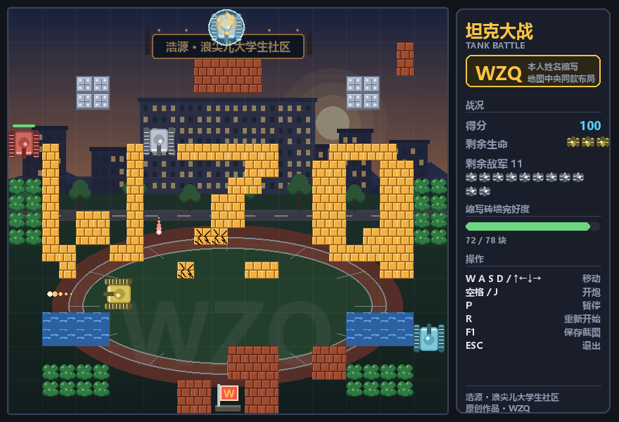
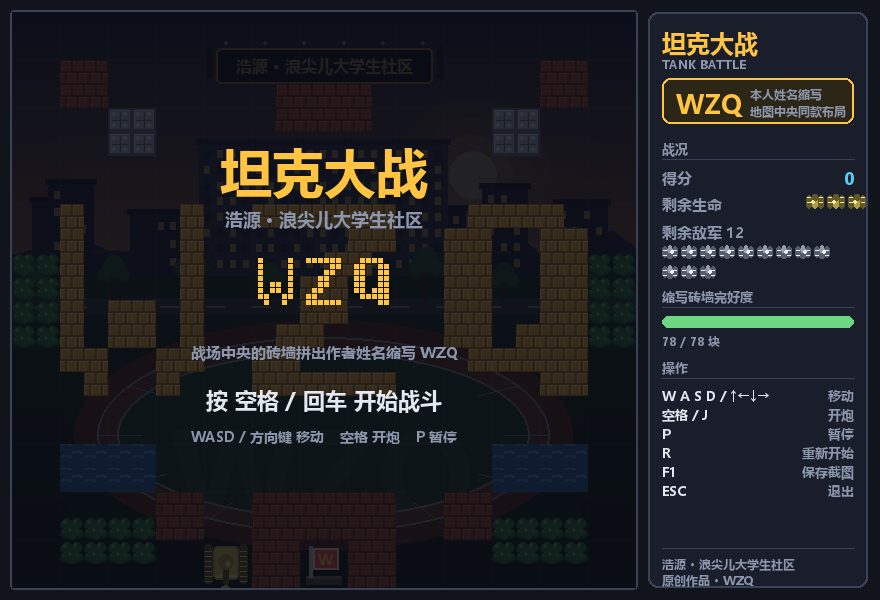
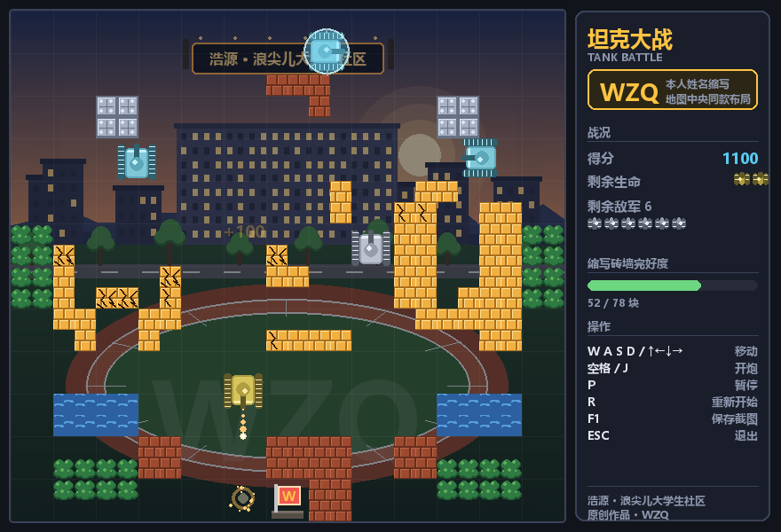
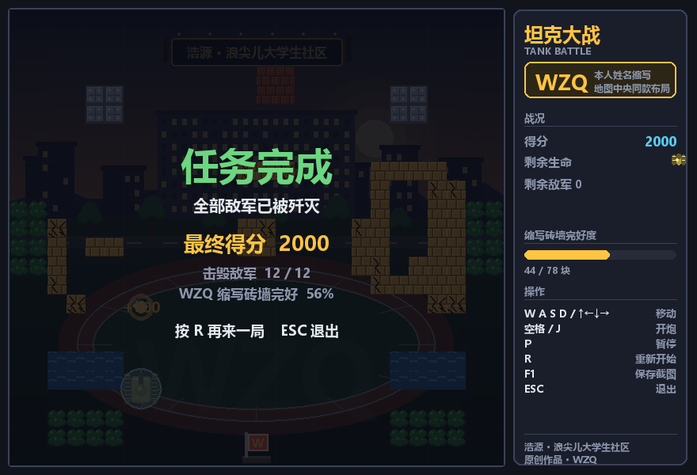

# 坦克大战 · WZQ

RST 竞赛训练营入营筛选赛 —— 附加题作品。

Python + pygame 实现的经典坦克大战。战场正中央的砖墙拼出作者姓名缩写 **WZQ**，
底图是一张现画的「浩源 · 浪尖儿大学生社区」校园黄昏场景。
全部美术、音效均由代码生成，**不含任何第三方图片或音频素材**。



---

## 一、运行方法

### 方式 1：双击运行（Windows）

双击 `运行游戏.bat`，脚本会自动检测并安装依赖后启动游戏。

### 方式 2：命令行

```bash
pip install -r requirements.txt
python main.py
```

环境要求：Python 3.8+、pygame 2.x。开发与测试环境为 Python 3.12 + pygame 2.6.1。

### 其他启动参数

| 命令 | 说明 |
| --- | --- |
| `python main.py` | 正常游玩 |
| `python main.py --demo` | 自动演示模式，由脚本托管玩家坦克，适合录屏 |
| `python main.py --mute` | 静音运行 |
| `python main.py --shot out.png --frames 500` | 跑 500 帧后保存一张截图 |
| `python main.py --headless --shot out.png` | 无窗口截图，用于没有显示器的环境 |

---

## 二、操作

| 按键 | 功能 |
| --- | --- |
| `W` `A` `S` `D` 或 方向键 | 移动坦克 |
| `空格` 或 `J` | 开炮（可按住连发，受装弹时间与同屏弹数限制） |
| `P` | 暂停 / 继续 |
| `R` | 重新开始 |
| `F1` | 保存当前画面到 `screenshots/` |
| `ESC` | 暂停 / 退出 |

---

## 三、玩法规则

- **目标**：歼灭全部 12 辆敌方坦克，同时守住底部基地。
- **失败条件**：基地被敌方炮弹摧毁，或 3 条命全部耗尽。
- **地形**
  - 红褐色砖墙：可被炮弹打穿。
  - **金色砖墙（WZQ 字样）**：加固过，需要连续命中 3 次才会塌，中途会显示裂纹。
  - 钢板：普通炮弹打不穿，只能绕行。
  - 水面：坦克过不去，但炮弹可以飞过——可以隔水对射。
  - 树林：坦克能从树下穿过，绘制在最上层，是埋伏与脱身的好地方。
- **敌人**

  | 类型 | 颜色 | 特点 | 分值 |
  | --- | --- | --- | --- |
  | 普通兵 | 灰白 | 速度与火力均衡 | 100 |
  | 快速兵 | 青蓝 | 移动与炮弹都更快 | 200 |
  | 装甲兵 | 暗红 | 3 点血，需要打三发 | 300 |

- **细节规则**
  - 出生时有 2 秒无敌保护，坦克外面套一圈闪烁的护罩。
  - 敌我炮弹迎面相撞会互相抵消。
  - 玩家的炮弹**打不穿自家基地**，只会被弹开——避免一进场手滑自爆，是有意为之的规则调整。

---

## 四、赛题加分点对照

### 1. 底图与场景设计

战场底图是一张程序化绘制的校园黄昏场景（`game/background.py`），从远到近依次是：

黄昏渐变天空 → 夕阳与光晕 → 两层远山 → 教学楼群剪影（带随机亮灯的窗户）→
「浩源 · 浪尖儿大学生社区」校名灯箱横幅 → 校道与行道树 → 操场跑道与分道线 →
草坪上的 WZQ 水印 → 半透明压暗层 + 暗角

最后一层压暗是刻意加的：底图再好看，也不能盖过游戏元素的可读性。

### 2. 身份标识（三重）

1. **地图布局**：战场正中央由砖墙拼出 `W` `Z` `Q` 三个字母，用金色砖块与普通砖墙区分。
   字母点阵定义在 `game/level.py` 的 `LETTER_BITMAPS`（6×8 点阵），
   由 `_place_initials()` 逐点写入地图网格。
2. **界面标识**：右侧信息栏顶部有 `WZQ` 徽标；信息栏实时显示「缩写砖墙完好度」进度条；
   开始界面画有 WZQ 的砖墙缩略图；基地旗帜上是 `W` 徽标。
3. **底图水印**：校园草坪上有一层淡淡的 `WZQ` 大字水印。

把 `settings.py` 里的 `PLAYER_INITIALS` 改成别的字母，地图、界面、水印会同步变化
（字母点阵目前收录了 W / Z / Q）。

---

## 五、目录结构

```
tank-game/
├── main.py              程序入口，命令行参数、演示模式
├── requirements.txt     依赖
├── 运行游戏.bat          Windows 一键启动
├── screenshots/         游戏截图
└── game/
    ├── settings.py      全局常量与配色，所有可调数值集中在这里
    ├── audio.py         程序合成音效（不依赖音频文件）
    ├── assets.py        字体与程序化贴图（不依赖图片文件）
    ├── background.py    原创校园底图绘制
    ├── level.py         地图生成（含 WZQ 布局）、地形碰撞与绘制
    ├── entities.py      坦克、子弹、爆炸、飘字
    ├── hud.py           右侧信息栏与菜单 / 暂停 / 胜负界面
    └── core.py          状态机、主循环、碰撞与胜负判定
```

---

## 六、实现要点

- **坐标与碰撞**：实体位置用浮点保存，再同步到整数矩形做 AABB 碰撞，
  避免低速移动因取整而丢失位移。炮弹按速度拆成若干小步逐步检测，防止高速穿墙。
- **转向吸附**：坦克转向时会把垂直方向的坐标吸附到 24 像素网格上，
  否则玩家很容易卡在墙角对不准通道口。吸附后若撞墙则自动还原。
- **地图连通性**：地图骨架是「四纵两横」——三个字母各占 6 列，字母之间与左右两侧
  天然留出 4 条各 2 格宽的纵向通道（刚好够一辆 44 像素的坦克通过），字母上下各留
  一条横向通道。掩体只摆在通道之外，生成的最后一步再用 `_carve_lanes()` 兜底清一遍，
  保证任何时候地图都是连通的，不会出现坦克被封死的死图。
- **敌人 AI**：定时或撞墙时重选方向，按权重偏向基地与玩家，其余情况随机；
  与玩家同行 / 同列时果断开火。对基地方向的开火概率被刻意压低——
  实测不压的话十二辆敌人会一路压到基地把它秒掉，玩家没有周旋空间。
- **无外部素材**：砖块、钢板、水面、树林、坦克、爆炸全部用 `pygame.draw` 现画并缓存；
  音效用 `array` 合成 16 位 PCM 波形交给 `pygame.mixer` 播放。
  没有声卡的环境会自动降级为静音，不影响游戏运行。

---

## 七、截图

| 开始界面 | 战斗中 |
| --- | --- |
|  |  |

| 胜利结算 |
| --- |
|  |

---

作者：WZQ　|　浩源 · 浪尖儿大学生社区　|　本作品为本人独立完成的原创作品
